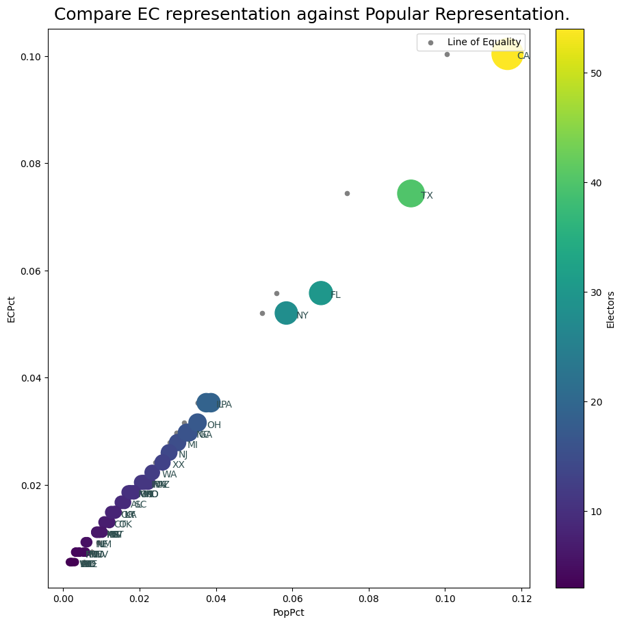

# Demonstrate Aggregation Functions in Pandas

Based on a couple of blog posts by [Dr. Drang](https://leancrew.com/all-this/):
 - https://leancrew.com/all-this/2024/08/what-i-didn-t-learn-about-the-electoral-college/
 - https://leancrew.com/all-this/2024/08/pandas-and-the-electoral-college/

 where he iterated over a Pandas dataframe to get some results, I tried to do the same thing using an aggregation function, to avoid the iteration step.  (Iterating over a DataFrame is almost always the wrong thing to do - it's fine when it's 50 rows, but the millions of rows datasets I normally work with would be very slow with iteration.)

The key is to supply an aggregation function to the `groupby` operation, so that pandas can take sensible actions with each of the fields.  To have a different action for each columnm, a dictionary of `'<field>': 'operation'` can be passed:

In this case, we have two text fields that we could like to join up as comma separated lists, and two numeric fields we would like to sum.  To aggregate the text fields, we need to define a function to convert the `pd.Series` object to a list, and then `join` the list using the build in `str.join()` function, as shown below. This could be done with a `lambda` function, but I prefer to define these things as a separate function.


```python

    ...

    def join_strs(s: pd.Series) -> pd.Series:
        """Aggregate a pd.Series to a Comma Separated List."""
        lst = s.to_list()
        return ', '.join(lst)

    agg_func = {'State': join_strs,
                'Abbrev': join_strs,
                'Population': 'sum',
                'Electors': 'sum'}

    # Aggregate the dataframe by the number of Electors, and aggregate
    # using the aggration function
    df_group = df[agg_func.keys()].groupby(by='Electors').agg(agg_func)

    ...

```
This produces ouput like this:

|  Electors  |           Abbrev           |   Population |   Electors |   PopPct |   ECPct |
|:----------:|:--------------------------:|-------------:|-----------:|---------:|--------:|
|     3      | AK, DC, DE, ND, SD, VT, WY |      5379033 |         21 |    1.61% |   3.90% |
|     4      | HI, ID, ME, MT, NH, RI, WV |     10196485 |         28 |    3.04% |   5.20% |
|     5      |           NE, NM           |      4092750 |         10 |    1.22% |   1.86% |
|     6      |   AR, IA, KS, MS, NV, UT   |     18766882 |         36 |    5.60% |   6.69% |
|     7      |           CT, OK           |      7671000 |         14 |    2.29% |   2.60% |
|     8      |         KY, LA, OR         |     13333261 |         24 |    3.98% |   4.46% |
|     9      |           AL, SC           |     10482023 |         18 |    3.13% |   3.35% |
|     10     |     CO, MD, MN, MO, WI     |     29902889 |         50 |    8.93% |   9.29% |
|     11     |       AZ, IN, MA, TN       |     28421431 |         44 |    8.49% |   8.18% |
|     12     |             WA             |      7812880 |         12 |    2.33% |   2.23% |
|     13     |             XX             |      8715698 |         13 |    2.60% |   2.42% |
|     14     |             NJ             |      9290841 |         14 |    2.77% |   2.60% |
|     15     |             MI             |     10037261 |         15 |    3.00% |   2.79% |
|     16     |           GA, NC           |     21864718 |         32 |    6.53% |   5.95% |
|     17     |             OH             |     11785935 |         17 |    3.52% |   3.16% |
|     19     |           IL, PA           |     25511372 |         38 |    7.62% |   7.06% |
|     28     |             NY             |     19571216 |         28 |    5.84% |   5.20% |
|     30     |             FL             |     22610726 |         30 |    6.75% |   5.58% |
|     40     |             TX             |     30503301 |         40 |    9.11% |   7.43% |
|     54     |             CA             |     38965193 |         54 |   11.63% |  10.04% |

## Other notes

Why separate files for electors and states? That was just the data that I found.  I could have easily put them together in the editor.

Added a silly plot:

